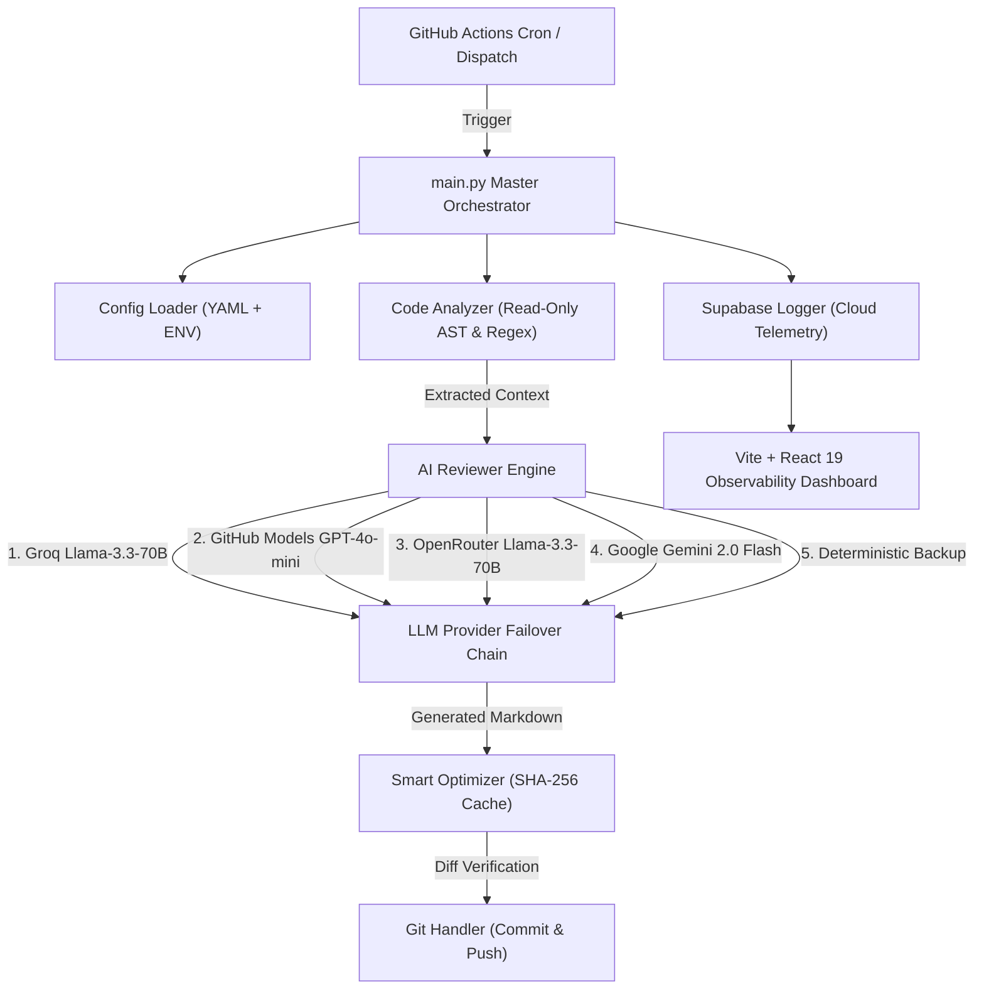

# 🤖 AutoREADME — Autonomous Multi-LLM Documentation Engine

<div align="center">

[](https://python.org)
[](https://react.dev)
[](https://vitejs.dev)
[](https://supabase.com)
[](https://github.com/features/actions)

**An enterprise-grade, secret-free autonomous documentation engine that continuously scans repository codebases, discovers undocumented features, and generates high-impact Markdown READMEs using resilient multi-provider AI failover.**

[Key Features](#-key-features) • [Architecture](#-architecture-overview) • [Dashboard](#-observability-dashboard) • [Quick Start](#-quick-start-guide) • [Configuration](#-configuration-guide)

</div>

---

## 🌟 Architecture Overview

AutoREADME operates as an autonomous sidecar for open-source and enterprise repositories. It listens for scheduled cron triggers or explicit API events, analyzes source code structures via read-only static analysis, synthesizes up-to-date documentation via multi-provider LLM chains, and streams live telemetry to an interactive glassmorphic dashboard.



---

## ✨ Key Features

### ⚡ 1. Multi-Provider LLM Resilience
Never suffer from API rate limits or single-provider outages. AutoREADME features an intelligent, multi-tier fallback chain:
1. **Groq**: `llama-3.3-70b-versatile` (Ultra-low latency primary)
2. **GitHub Models**: `gpt-4o-mini` (High-accuracy fallback)
3. **OpenRouter**: `meta-llama/llama-3.3-70b-instruct:free` (Community fallback)
4. **Google Gemini**: `gemini-2.0-flash` (Generative fallback)
5. **Deterministic Timestamp Backup**: Guarantees zero workflow failures even during total AI service outages.

### 🔍 2. Read-Only Source Code Intelligence
The engine includes a dedicated, **100% read-only AST and regex parser** (`code_analyzer.py`) that extracts:
- Class definitions, public methods, and function signatures.
- API endpoints and web routes (Flask, FastAPI, Express, Django).
- Environment variable requirements (`os.getenv`, `process.env`).
- CLI arguments (`argparse`), dependencies (`package.json`, `requirements.txt`), and Docker configurations.
*The source code analysis is automatically injected into the AI context to discover undocumented features without ever touching source files.*

### 🛡️ 3. Smart Token & Hashing Optimizer
- Computes **SHA-256 hashes** of target README files before executing AI calls.
- Skips redundant LLM requests when documentation content is up to date, saving API token quotas and runner execution minutes.

### 📊 4. Glassmorphic Observability Dashboard
Built with **React 19**, **Vite**, **Recharts**, and **Lucide Icons**:
- Real-time tracking of AI token consumption, runner latency, and 5-day commit heatmaps.
- One-click **RUN** manual trigger, **LOW-POWER** maintenance mode toggle, and emergency **KILL-SWITCH** lock.
- Interactive **DiffViewer** to compare original vs. AI-improved markdown directly in the UI.

### 🔒 5. Zero-Secret Public Architecture
- 100% sanitized for open-source distribution.
- All credentials (API keys, GitHub PATs, Supabase keys) are dynamically loaded from environment variables or GitHub Secrets.
- RPC functions (`update_config_secure`) enforce secure password verification for remote database modifications.

---

## 📁 Repository Structure

```
AutoREADME/
├── .github/
│   └── workflows/
│       └── auto-improve.yml     # Automated workflow schedule & API dispatch listener
├── dashboard/                   # Observability dashboard (React 19 + Vite + Recharts)
│   ├── api/                     # Vercel serverless edge functions (Auth, Trigger, Schedule)
│   ├── src/                     # Dashboard components, charts & DiffViewer
│   └── vite.config.js
├── ai_reviewer.py               # Multi-provider LLM orchestration layer
├── code_analyzer.py             # Read-only static code & AST analyzer
├── config_loader.py             # YAML & environment configuration parser
├── git_handler.py               # Autonomous git clone, commit, & push handler
├── main.py                      # Master orchestrator entrypoint
├── optimizer.py                 # SHA-256 hashing cache & token optimizer
├── supabase_logger.py           # Telemetry & cloud database logger
├── supabase_schema.sql          # PostgreSQL schema, RLS policies, & RPC functions
├── config.yaml                  # System & repository configuration file
├── .env.example                 # Environment variables template
└── requirements.txt             # Python dependencies
```

---

## 🚀 Quick Start Guide

### 1. Prerequisites
- **Python**: `3.10` or higher
- **Node.js**: `18.0` or higher
- **Git**: Installed locally

### 2. Environment Setup

Clone the repository and create your local environment file:

```bash
git clone https://github.com/your-username/AutoREADME.git
cd AutoREADME
cp .env.example .env
```

Edit `.env` with your API credentials:

```env
# AI Provider Credentials (Provide at least one)
GEMINI_API_KEY=your_gemini_api_key
GROQ_API_KEY=your_groq_api_key
OPENROUTER_API_KEY=your_openrouter_api_key

# GitHub Credentials (For autonomous git commits & API triggers)
GITHUB_TOKEN=your_github_pat_token
GITHUB_USERNAME=your_github_username
GITHUB_REPO=your_username/your_repo

# Cloud Telemetry (Optional)
SUPABASE_URL=https://your-project.supabase.co
SUPABASE_KEY=your_supabase_anon_key

# Dashboard Protection
DASHBOARD_PASSWORD=your_secure_password
```

### 3. Install Dependencies

```bash
pip install -r requirements.txt
```

### 4. Run the Engine Locally

Execute the orchestrator to analyze target repositories and update documentation:

```bash
python main.py
```

### 5. Launch the Observability Dashboard

```bash
cd dashboard
npm install
npm run dev
```

Open [http://localhost:5173](http://localhost:5173) in your browser to inspect live telemetry and trigger manual runs.

---

## ⚙️ Configuration Guide (`config.yaml`)

Customize how AutoREADME monitors and refines target repositories:

```yaml
# Repositories to monitor and improve automatically
repos:
  - "https://github.com/your-username/your-project-1"
  - "https://github.com/your-username/your-project-2"

# Primary documentation improvement objectives
readme_goals:
  - "Improve technical clarity, tone, and professional structure"
  - "Fix grammar, spelling, and Markdown formatting errors"
  - "Ensure complete installation, dependency, and usage instructions"
  - "Discover and add undocumented features discovered via source code analysis"

# Read-only source scanner extensions
source_scan_extensions:
  - ".py"
  - ".js"
  - ".ts"
  - ".jsx"
  - ".tsx"
  - ".java"
  - ".go"
  - ".sh"
  - ".yml"

# Performance & Quota Guardrails
force_change: true          # Force commit activity check
maintenance_mode: false     # Low-power mode (skips heavy LLM passes)
max_files_per_repo: 5
max_tokens_per_file: 8000
```

---

## 🔒 Security & Sanitization Policy

- **Zero Credential Leaks**: Credentials are never written to repository files or committed to Git.
- **Read-Only Code Analysis**: The static analyzer strictly reads file content and produces in-memory feature summaries. It has zero code modification permissions.
- **RPC Password Authentication**: Administrative actions (toggling maintenance mode, updating execution schedules) require authentication via Supabase RPC security definers.

---

<div align="center">

**Built by Aradhya Sonar for Autonomous Operations**

</div>

---
*📝 Last maintained: August 30, 2026 at 22:55 UTC*
