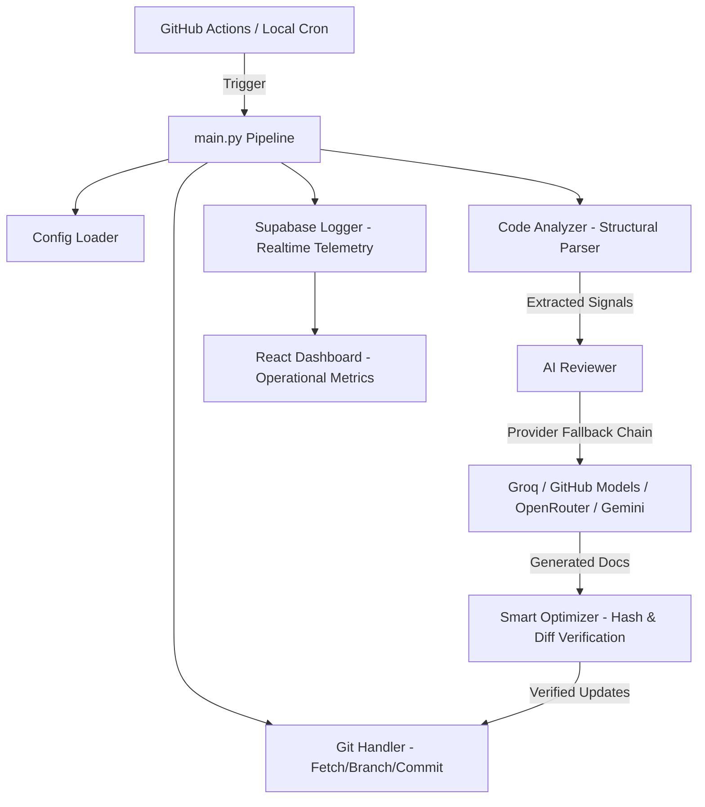

# 📡 RepoSonar — Autonomous Code Documentation Engine

> An enterprise-grade, secret-free showcase of an autonomous AI documentation infrastructure. RepoSonar scans codebases, extracts technical features, and maintains up-to-date documentation via automated Git workflow integration and multi-provider LLM resilience.

---

## 🌟 Architecture Overview

RepoSonar acts as an autonomous documentation sidecar for repositories. It listens for changes, performs structural feature analysis, generates formatted technical READMEs using resilient AI fallback chains, and logs operational metrics to a real-time observability telemetry database.



---

## ✨ Key Features

1. **Multi-Provider LLM Resilience**:
   - Primary: **Groq** (`llama-3.3-70b-versatile`)
   - Secondary: **GitHub Models** (`gpt-4o`)
   - Tertiary: **OpenRouter** (`meta-llama/llama-3.1-70b-instruct`)
   - Quaternary: **Google Gemini** (`gemini-2.5-flash`)
   - Fallback: **Deterministic Timestamp Backup** (ensures workflow integrity even during total AI outage)

2. **Smart Token & Hashing Optimizer**:
   - Uses SHA-256 content hashing to avoid redundant AI calls.
   - Saves API budget by only executing LLM passes when code features meaningfully change.

3. **Read-Only Code Parsing**:
   - Extends static analysis to extract class structures, route handlers, imports, and dependencies without modifying source code files.

4. **Realtime Telemetry & Security**:
   - Logs execution runs, processing latencies, AI provider switches, and errors to Supabase.
   - Built-in RPC password verification prevents unauthorized dashboard mutations.

---

## 📁 Repository Structure

```
RepoSonar/
├── .github/
│   └── workflows/
│       └── auto-improve.yml   # GitHub Actions workflow schedule & dispatch
├── dashboard/                 # Vite + React observability dashboard
│   ├── api/                   # Serverless edge function routes (Auth, Trigger, Schedule)
│   ├── src/                   # Dashboard components & chart visualizers
│   └── vite.config.js
├── ai_reviewer.py             # Multi-provider LLM orchestration layer
├── code_analyzer.py           # Read-only static analysis and AST parser
├── config_loader.py           # Environment variable priority configuration parser
├── git_handler.py             # Git operations & automated commit engine
├── main.py                    # Master orchestrator entrypoint
├── optimizer.py               # SHA-256 state tracking & redundant run filter
├── supabase_logger.py         # Telemetry database logger
├── supabase_schema.sql        # Database schema, RLS policies, and RPC definitions
├── config.yaml                # Default system configuration
├── .env.example               # Environment variables template
└── requirements.txt           # Python dependencies
```

---

## 🚀 Quick Start Guide

### 1. Prerequisites
- Python 3.10+
- Node.js 18+ (for dashboard)
- Git installed locally

### 2. Environment Setup

Clone or copy `RepoSonar` into your workspace:

```bash
git clone https://github.com/your-username/RepoSonar.git
cd RepoSonar
```

Copy `.env.example` to `.env` and fill in your preferred credentials:

```bash
cp .env.example .env
```

```ini
GEMINI_API_KEY=your_gemini_key
GROQ_API_KEY=your_groq_key
OPENROUTER_API_KEY=your_openrouter_key
GITHUB_TOKEN=your_github_pat
SUPABASE_URL=https://your-project.supabase.co
SUPABASE_KEY=your_supabase_anon_key
```

### 3. Install Dependencies

```bash
pip install -r requirements.txt
```

### 4. Run Pipeline Locally

To test the documentation generation pass locally:

```bash
python main.py
```

---

## 🔒 Security & Sanitization Notice

This showcase repository has been thoroughly sanitized:
- **Zero Hardcoded Secrets**: All API keys, tokens, and endpoints are injected dynamically via environment variables.
- **RPC Verification**: Admin actions in the telemetry dashboard are protected by RPC functions in Supabase (`verify_dashboard_password` and `update_config_secure`).
- **Safe Fallbacks**: If no LLM credentials are provided, the engine safely runs in deterministic mode without failing.

---

## 📄 License

MIT License — free for educational, analytical, and showcase purposes.
